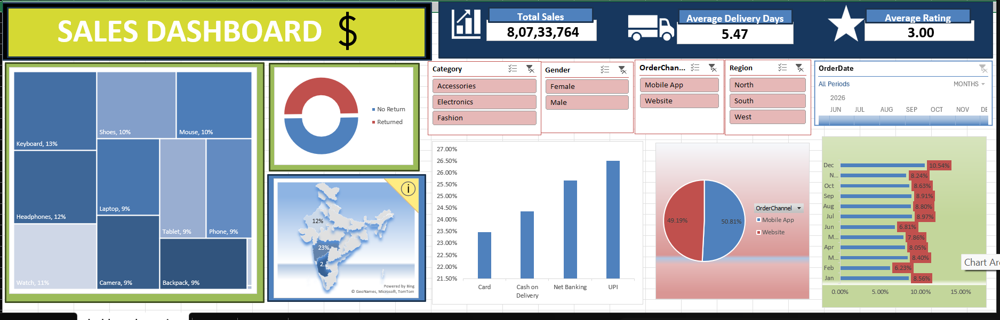

# 📊 Sales Performance Dashboard | Microsoft Excel

An interactive **Sales Performance Dashboard** built in **Microsoft Excel** to transform raw sales data into meaningful business insights. The dashboard enables users to analyze sales trends, customer ratings, regional performance, and shipping methods through dynamic visualizations, Pivot Tables, Pivot Charts, Slicers, and Timeline filters.

---

## 📷 Dashboard Preview



---

## 🎯 Project Objective

The objective of this project is to convert raw sales data into an interactive dashboard that helps businesses monitor key performance indicators (KPIs), identify trends, and support data-driven decision-making.

---

## 📌 Key Features

- 📈 Interactive Sales Dashboard
- 🎛️ Dynamic Slicers
- 📅 Timeline Filter
- 📊 Pivot Tables & Pivot Charts
- 🗺️ State-wise Sales Analysis (Map Chart)
- 🌳 Treemap Visualization
- 🍩 Doughnut Chart
- 📉 Monthly Sales Trend Analysis
- 📦 Category-wise Sales Analysis
- 🚚 Ship Mode Performance Analysis
- ⭐ Customer Rating Analysis

---

## 📊 Dashboard KPIs

The dashboard tracks important business metrics, including:

- 💰 Total Sales
- ⭐ Average Customer Rating
- 🚚 Average Delivery Days

These KPIs provide a quick overview of overall business performance.

---

## 📂 Dataset Information

| Attribute | Details |
|-----------|---------|
| Dataset Size | Approximately 1,000 Records |
| Data Type | Sales Transactions |
| Fields Included | Order Date, State, Category, Sales, Rating, Ship Mode, Delivery Details |
| Data Source | Sample Sales Dataset |

---

## 🛠 Tools & Skills Demonstrated

### Microsoft Excel
- Pivot Tables
- Pivot Charts
- Slicers
- Timeline
- KPI Cards
- Conditional Formatting
- Dashboard Design
- Data Visualization
- Data Analysis

---

## 📈 Business Insights

Using this dashboard, users can:

- Identify top-performing states.
- Compare sales across product categories.
- Analyze customer ratings.
- Monitor monthly sales trends.
- Evaluate shipping performance.
- Interactively filter data using Slicers and Timeline.

---

## 🚀 How to Use

1. Download the Excel workbook.
2. Open **Sales_Performance_Dashboard.xlsx** in Microsoft Excel.
3. Enable editing if prompted.
4. Use the **Slicers** and **Timeline** to filter data.
5. Explore different charts and KPIs for business insights.

---

## 📁 Repository Structure

```
excel-sales-dashboard/
│
├── Sales_Performance_Dashboard.xlsx
├── Dashboard_Preview.png
└── README.md
```

---

## 💡 Skills Highlighted

- Data Cleaning
- Dashboard Development
- Business Intelligence
- Data Visualization
- Excel Reporting
- Analytical Thinking

---

## 🔮 Future Improvements

- Power Query for automated data cleaning
- Power Pivot integration
- Advanced KPI calculations
- Forecasting Dashboard
- Automated data refresh

---

## 👩‍💻 Author

**Kritika Suneja**

BCA Student | Aspiring Data Analyst

---

### ⭐ If you found this project interesting, consider giving it a Star!
